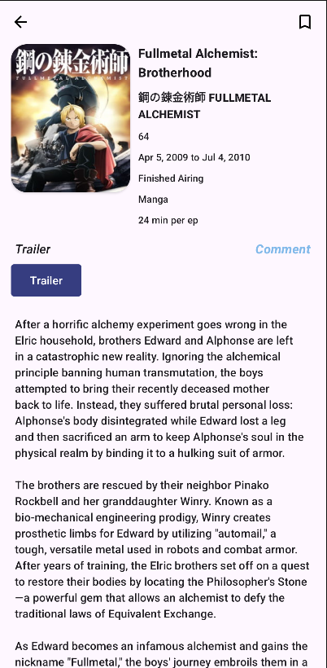
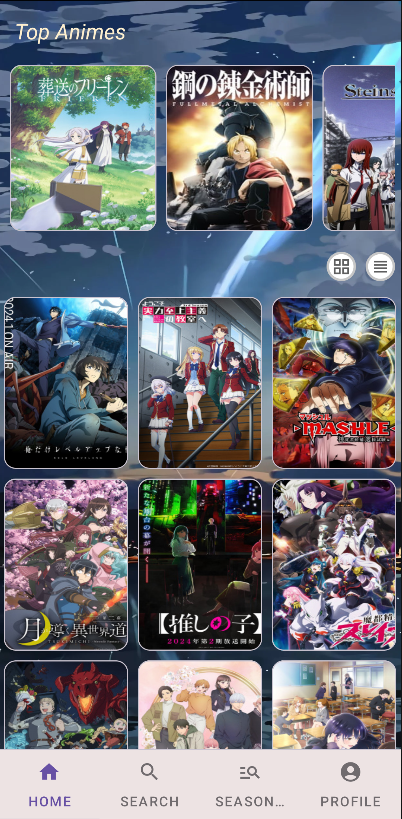
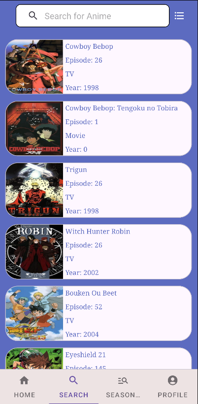

# MyAnimeApp

## Introduction

(https://www.figma.com/file/jawa5qViYHsTcDlxab5unJ/MAL-Clone?type=design&node-id=0-1&mode=design&t=uT0BeBFjr4XpJCk8-0)

Hello!, This is an attempt to recreate MyAnimeList(https://myanimelist.net/) in Android Studio using Jikan(https://docs.api.jikan.moe/), This Application allows users to view a catelog of released anime shows, allows users to view the details on any specific show from when it was released, its orignal japanese title, how long each episode is and watch the pv trailers for them.

    
    
    
    

## Features

- User Registration and Login: Users can create an account and login.
  
- Search for Anime: Users can search for anime by name or by year and season.
  
- View Anime Details: View a synopsis on the anime, details on how many episodes are there, how long it aired for, preview trailers, etc are shown.

- Comment System: Comment on anime you've watched and look at what others have to say about it.
  
- Favorite and Unfavourite Anime: Users can mark anime as favorites and view a list of their favorite anime. They can also remove anime from their favorites.
  

## Future Updates

- Improved comment system, allowing direct replies to be shown

## Technologies Used

This project is built with Kotlin and follows the Model-View-ViewModel (MVVM) architectural pattern. It uses Firebase for backend services and data storage, and Gradle for build automation. The project is version-controlled and managed using GitHub.

This project relies on several dependiencies :

Android Jetpack's Navigation(https://developer.android.com/guide/navigation) and Lifecycle(https://developer.android.com/jetpack/androidx/releases/lifecycle).

Firebase(https://firebase.google.com/) to store user data.

Retrofit(https://square.github.io/retrofit/) to access the API.

Glide(https://github.com/bumptech/glide) to load and cache images.

DaggerHilt(https://dagger.dev/hilt/) for dependecy injections.

PierfrancescoSoffritti's open source Youtube player libary (https://github.com/PierfrancescoSoffritti/android-youtube-player) to access and play videos from youtube.

## Installation

1. Make sure you have the latest version of Android Studio installed. You can download it from [here](https://developer.android.com/studio).
2. Clone this repository and open it in Android Studio.
3. Paste this into local.properties in your gradle folder(baseUrl="https://api.jikan.moe/v4/") without parentheses.
4. Run the app on an emulator or physical device.

## Usage

After launching the application, you will be greeted with a login screen. If you are a new user, click on "Register" to create a new account. Once logged in, you will be greeted with the home screen and a navigation bar on the bottom.

There are 4 options "Home", "Search", "Seasonal" and "Profile". Clicking "Search" will bring you to the search page, to search click on the search bar and type out the show you're looking for.

The "Seasonal" page will list out options for searching shows by the year and season it was released in, "Profile" shows you your username and profile pic which is selectable by pressing the + icon, it also allows you to view favorites and logout.

You can also favorite a show by clicking on the heart icon, and view your favorite show in the "Profile" section.

## License

This project is licensed under the terms of the MIT license.

## Contributing

This project is a part of a school project and is not open for contributions.

## Acknowledgments

This project is a part of a school group project for the 4th semester.

## Contact Information

If you have any questions or would like to submit a bug report, please reach out to the dev team at:

[waijian22g@forward.edu.my](mailto:waijian22g@forward.edu.my).

[zhisean22w@forward.edu.my](mailto:zhisean22w@forward.edu.my).

[tzehernbryan22w@forward.edu.my](mailto:tzehernbryan22w@forward.edu.my).

## Frequently Asked Questions or Troubleshooting

**Q: The app says there are too many requests. What can I do?**
A: As we are using a free api there are limits to how many requests can be made, please wait and try again.

**Q: The app is crashing. What can I do?**
A: Restart the app and try again.
