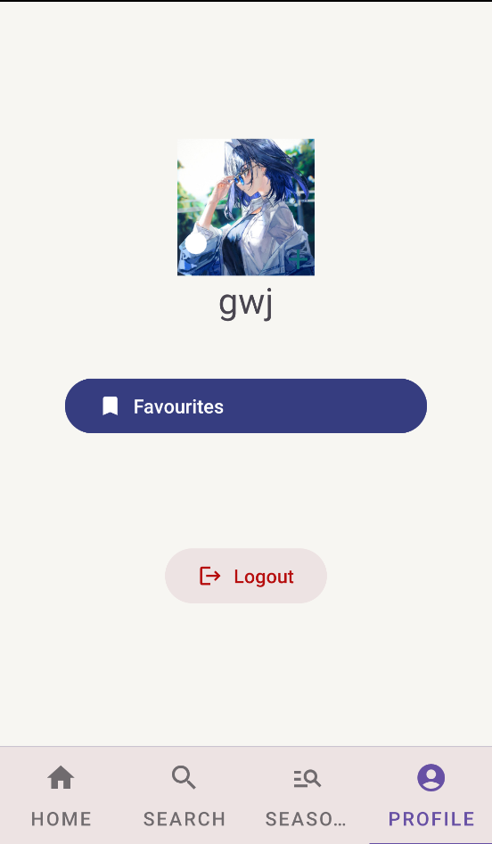

# AnimeApp Android App.

Welcome to AnimeApp, an ideal destination for anime enthusiasts. AnimeApp is an Android app that offers a seamless and personalised experience for anime fans. Dive into the world of your favourite anime, interact with the community, and stay up to date on the latest releases.

    
    
    
    

## Features.

### User Authentication: Register and create a secure account.
- Sign in to access personalised features.
- Recover your password if you forgot it.

## Anime Favorites:
- Mark and organise your favourite anime for easy access.
- Create a curated list of anime that speaks to you.

## Comments and Reviews:
- Contribute to the anime community by leaving comments and reviews on each page.
- Share your thoughts and recommendations with other users.

## Search and Genres:
- Use the powerful search feature to explore the diverse world of anime.
- Discover anime based on your favourite genres.

### Seasonal Anime:
- Keep up with the latest releases by exploring anime by year and season.
- The seasonal feature allows you to plan your anime watching schedule.

### Custom YouTube Player:
- Get a personalised UI for the YouTube player in the app.
- Enjoy anime-related content seamlessly with a personalised viewing experience.

### Notifications:
- Stay up-to-date with new releases and updates via notifications after inactivity.
- Customise notification settings to create a more personalised experience.

## Future Updates

We have exciting plans for upcoming updates, including:

## Improved Comment System: - Direct replies to comments.
- Respond to other users directly.

## Enhanced User Profiles: - Customise your profile to reflect your anime preferences.
- Connect with other users who have similar interests.

### Advanced Search Filters: - Improve your anime search experience by filtering by rating, popularity, and other criteria.

### Community Features: - Join discussions, forums, and events within the app.
- Work with other users to compile lists and recommendations.

## Technology Used

AnimeApp uses the following technologies to provide a seamless experience:

- Android Jetpack's Navigation and Lifecycle
- Firebase provides secure user authentication and data storage.
- Retrofit to access the Jikan API, which provides comprehensive data about anime series, including details, images, and user ratings.
- Glide for smooth image loading and caching
- Dagger Hilt for dependency injection
- YouTube Player Library for personalised YouTube viewing experience
- Retrofit to access the [Jikan API](https://jikan.moe/), which provides comprehensive data about anime series, including details, images, and user ratings.

## Libraries Used

This project uses the following third-party libraries:

- [Android Jetpack's Navigation and Lifecycle](https://developer.android.com/jetpack/androidx/releases/navigation)
- [Firebase](https://firebase.google.com/)
- [Retrofit](https://square.github.io/retrofit/)
- [Glide](https://github.com/bumptech/glide)
- [Dagger Hilt](https://dagger.dev/hilt/)
- [YouTube Player Library](https://developers.google.com/youtube/android/player)
- [android-youtube-player](https://github.com/PierfrancescoSoffritti/android-youtube-player)

For more information on these libraries, please visit their respective links.

## Installation

1. Clone the repository using 'git clone [https://github.com/GWJian/sem4_anime_app.git]'.
2. Paste this into local.properties in your gradle folder(baseUrl="https://api.jikan.moe/v4/") without parentheses.
2. Set up Firebase: Create a Firebase project and configure it in accordance with the Firebase documentation.
3. Add API Keys: Obtain API keys for services such as Jikan and YouTube and enter them into the relevant configuration files.
4. Build and Run: Create and run the project in Android Studio.

## Usage

Explore AnimeApp and take full advantage of its features:

- Login or create an account.
- Choose your favourite anime.
- Use comments and reviews to interact with the community.
- Use the search and genre options to find new anime.
- Keep up with seasonal anime releases.
- Enjoy a personalised YouTube player for anime-related content.
- Customise notification settings to create a more personalised experience.

## Licence.

This project is licenced under the MIT licence.

## Contribute

We welcome contributions! If you wish to contribute to AnimeApp, please follow the instructions in the Contributing file.

## Acknowledgements

We are grateful to the creators and contributors of the technologies used in AnimeApp, as well as the supportive open-source community.

## Contact Information.

For any questions or feedback, please contact us at: 

[waijian22g@forward.edu.my].

[zhisean22w@forward.edu.my].

[tzehernbryan22w@forward.edu.my].

## Frequently Asked Questions & Troubleshooting

**Q: The app saying there are too many HTTP requests. What can I do?**
A: As we are using a free api there are a limit to how many requests that can be made, please wait and try and.

**Q: The app is crashing. What can I do?**
A: Restart the app and try again.

If you encounter any more problems or have questions, please see the FAQs or report them in the repository's Issues section.
